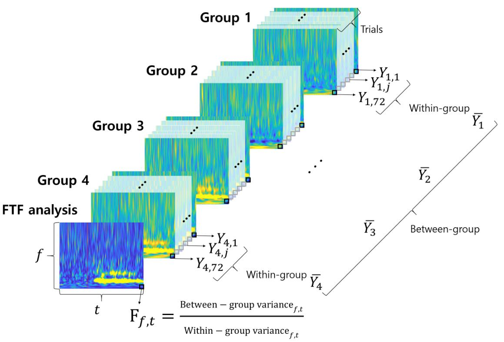

# F-value time-frequency (FTF) analysis

This is a Matlab code for F-value time-frequency (FTF) analysis. FTF analysis applies the F-value of ANOVA to time-frequency analysis. FTF analysis represents the statistical differences among conditions in both the time and frequency domains.
You can use this code for academic purpose.
To use the FTF function in your research, please cite the following paper:
Hong Gi Yeom, F-value time-frequency (FTF) analysis: between-within variance analysis, 2021
https://doi.org/10.3389/fnins.2021.729449
