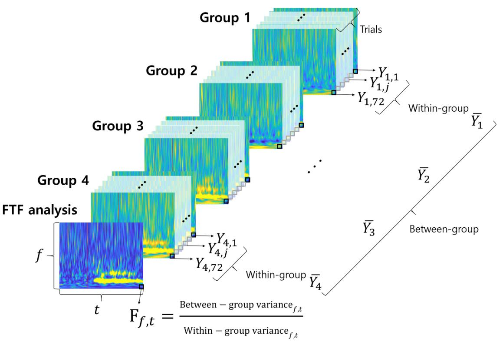

# F 值时频 (FTF) 分析

  <a href="README.md">English</a> |
  <a href="README.de.md">Deutsch</a> |
  <a href="README.es.md">Español</a> |
  <a href="README.fr.md">français</a> |
  <a href="README.ja.md">日本語</a> |
  <a href="README.ko.md">한국어</a> |
  <a href="README.pt.md">Português</a> |
  <a href="README.ru.md">Русский</a> |
  <a href="README.zh.md"><strong>中文</strong></a>

该存储库提供了论文“F值时频（FTF）分析：组内方差分析”中提出的F值时频（FTF）分析方法的MATLAB代码。

## 算法：F 值时频 (FTF) 分析

FTF 分析是一种新技术，通过应用方差分析 (ANOVA) 中的 F 值，在时频图上可视化统计显着性。它旨在识别和量化时间序列数据中多个条件之间的差异，例如脑电图 (EEG)。

### 主要特点和方法
* **统计可视化**：与仅显示功率或幅度的传统时频图不同，FTF 图直接可视化每个时频点的 F 值。这使得研究人员能够立即确定实验条件之间最显着的差异在哪里。
* **方差分析**：该方法的核心是计算条件间方差与条件内方差的比率。高 F 值表示条件之间的变化明显大于每个条件内的变化，表明效果真实。
* **直观解释**：生成的 FTF 图突出显示了信号在不同条件下显着差异的特定时间点和频段。这提供了一个直观而强大的工具来分析复杂的神经信号，例如来自运动想象任务的信号，而无需对功率图本身进行事后统计测试。

此存储库中的 MATLAB 代码包括对您自己的时间序列数据执行 FTF 分析所需的函数和示例脚本。

## 引文

如果您使用此代码进行研究，请引用以下论文：

* Yeom，H.G.（2021）。 F值时频（FTF）分析：组内方差分析。 *神经科学前沿*, 15, 729449。
    (https://doi.org/10.3389/fnins.2021.729449)

## 用法

有关详细说明，请参阅此存储库中的 MATLAB 脚本和文档。
https://doi.org/10.3389/fnins.2021.729449
